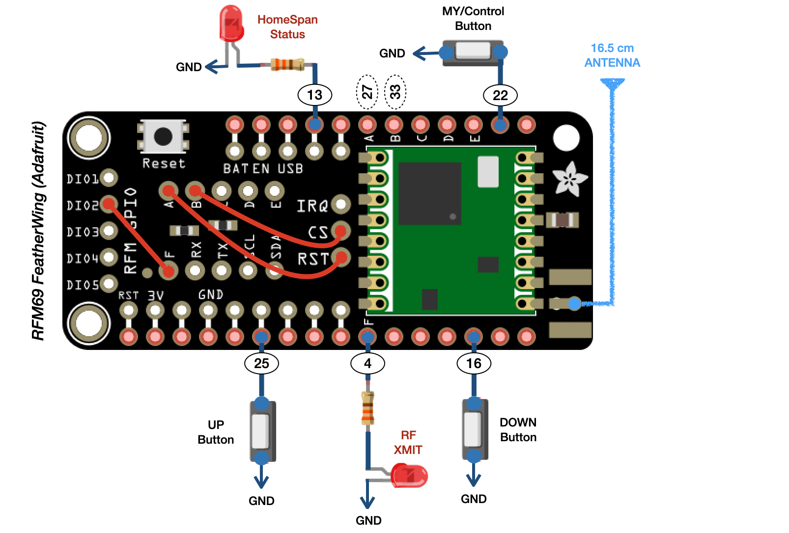
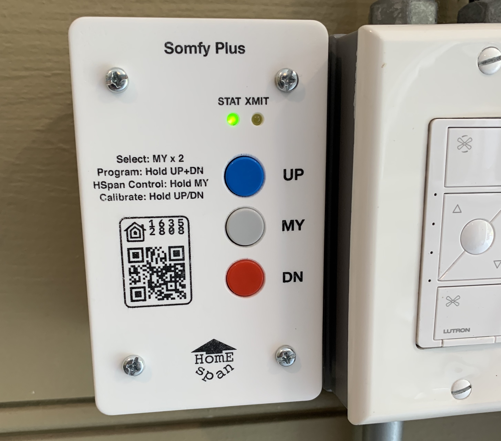

# SomfyPlus - A HomeSpan Project

SomfyPlus is a universal, multi-channel, HomeKit Controller for Somfy RTS Motorized Window Shades and Patio Screens.  Built using the [HomeSpan](https://github.com/HomeSpan/HomeSpan) HomeKit Library, SomfyPlus is designed to run on an ESP32 device as an Arduino sketch.  

Hardware used for this project:

* An ESP32 board, such as the [Adafruit HUZZAH32 – ESP32 Feather Board](https://www.adafruit.com/product/3405)
* An RFM69 Transceiver, such as this [RFM69HCW FeatherWing](https://www.sparkfun.com/products/10534) from Adafruit
* Three pushbuttons (normally-open) to serve as the Somfy UP, DOWN, and MY buttons (the MY button also serves as the HomeSpan Control Button), such as these [12 mm round tactile buttons](https://www.adafruit.com/product/1009) from Adafruit
* One LED and current-limiting resistor to serve as the HomeSpan Status LED
* One LED and current-limiting resistor to provide visual feedback when the RFM69 is transmitting Somfy RTS signals
* a [Adafruit FeatherWing Proto Board](https://www.adafruit.com/product/2884) to mount the buttons and LEDs

## Overview

Somfy motors are widely used to drive automated window shades, patios screens, and porch awnings.  And though there are many different models, almost all are controlled with an RF system called RTS ([Radio Technology Somfy](https://asset.somfy.com/Document/dcb579ff-df8d-47d8-a288-01e06a4480ab_RTS_Brochure_5-2019.pdf)) operated with Somfy RF controllers, such as the 5-channel [Somfy Tellis RTS](https://www.somfysystems.com/en-us/products/1810633/telis-rts).

All Somfy remotes feature:

* an UP button that typically raises the window shade or screen until it is fully opened
* a DOWN button that typically lowers the window shade or screen until it is fully closed
* a button labeled "MY" that serves two purposes - 
  * if the shade is moving, pressing the MY button stops the motor
  * if the shade is stopped, pressing the MY button moves the shade to a predefined position (the "MY" position)
* a PROGRAM button that is used to put the shade or screen into programming mode so you can link additional remotes
* a channel SELECTOR switch (if the remote allows the user to control more than one shade or screen)

Based on the **superb** work by [Pushstack](https://pushstack.wordpress.com/somfy-rts-protocol/) and other contributors, who reverse-engineered and documented the Somfy-RTS protcols (much thanks!), we can construct a fully-functional, *HomeKit-enabled*, multi-channel Somfy remote using an ESP32, a simple RF transmitter, and the Arduino [HomeSpan Library](https://github.com/HomeSpan/HomeSpan).

Apart from the obvious benefit of having HomeKit (and Siri!) control of your Somfy shades and screens, a SomfyPlus remote also includes two additional benefits:

* **Control up to 32 channels!**  Have 20 window shades spread across 5 rooms?  No problem - you can operate all of them with a single SomfyPlus device.

* **Use HomeKit to set the absolute position of your window shade or screen!**  HomeKit natively supports sliders that allow you to specify the exact position of a window shade, from fully open (100%) to fully closed (0%) in increments of 1%.  Unfortunately, the Somfy RTS system does not generally support two way communications, nor do the motors transmit any status about the position of the shade or screen.  However, some clever logic inside the sketch and a few timing parameters is all that is needed to configure SomfyPlus to track and directly set a window shade to any desired target position.

## Before You Begin

This is an intermediate-level project that **assumes you are already familiar with HomeSpan**, including how to:

* compile Arduino sketches using the HomeSpan Library;
* configure a HomeSpan device with your home network's WiFi Credentials;
* pair a HomeSpan device to HomeKit;
* use the HomeSpan Command Line Interface (CLI); and
* use the HomeSpan Control Button and Status LED.

If you are unfamiliar with these processes, or just need a refresher, please visit the [HomeSpan](https://github.com/HomeSpan/HomeSpan) GitHub Repository and review [Getting Started with HomeSpan](https://github.com/HomeSpan/HomeSpan/blob/master/docs/GettingStarted.md) before tackling this project.  Note that configuring SomfyPlus to operate your own shades and screens does not require you to develop any of your own HomeSpan code but you nevertheless may want to first try out some of the [HomeSpan Tutorials](https://github.com/HomeSpan/HomeSpan/blob/master/docs/Tutorials.md) to ensure HomeSpan operates as expected in your environment.

## Step 1: Configuring SomfyPlus and Uploading the Sketch to an ESP32 Device

SomfyPlus is designed to operate as a HomeKit *Bridge* where each each window shade or screen is implemented as a separate HomeKit *Accessory* containing a single instance of a HomeKit *Window Covering Service*.  The logic for each Somfy shade or screen is encapsulated in the `SomfyShade()` class.

To customize SomfyPlus for your own home, simply modify the *SomfyPlus.ino* sketch file and create an instance of `SomfyShade()` for each Somfy shade or screen you want to control with with SomfyPlus as follows: 

`new SomfyShade(uint8_t channel, char *name, uint32_t raiseTime=10000, uint32_t lowerTime=10000);`

* *channel* - the channel number you want to assign to the window shade or screen.  Must be between 1 and 32
* *name* - the name of the Somfy Shade as it will appear in the Home App on your iPhone
* *raiseTime* - the time (in ms) for the shade to raise from fully closed to fully open (optional, default = 10 sec)
* *lowerTime* - the time (in ms) for the shade to lower from fully open to fully closed (optional, default = 10 sec)

For example, the code snippet below would be used to create 4 window shade/screens in SomfyPlus.  Note that the channel numbers you specify do not need to be consecutive - they can be in any order:

```C++
new SomfyShade(1,"Screen Door");
new SomfyShade(2,"Living Room Window Shade");
new SomfyShade(6,"Den Blinds",8500,7300);
new SomfyShade(3,"Den Curtains",9000,9000);
```

Feel free to leave the raise and lower times for your shades as the default of 10 seconds.  These times can be calibrated later with SomfyPlus once your remote is fully operational.  Note you can add, remove, or modify your channel configuration at any time, even after SomfyPlus has been paired with HomeKit.  Changes you make will automatically be reflected in the Home App on your iOS device.  However, once you link a shade to a specific channel (see below) that channel must always be used for that same shade unless you unlink the shade.

Complete this step by compiling and uploading your configured SomfyPlus sketch to an ESP32 device.

## Step 2: Connecting SomfyPlus to Your Home Network and Pairing with HomeKit

Once the sketch has been uploaded, connect SomfyPlus to your home network as you would any HomeSpan device.  Next, pair SomfyPlus to HomeKit. For each instance of the `SomfyShade()` class in your sketch, you should now see a Tile in your Home App that allows you to control the shade.

Once you have verified the Tiles operate as expected, proceed to the next step.

## Step 3: Constructing the Hardware

In addition to an ESP32 board, SomfyPlus requires a "433 MHz" transmitter.  However, rather than using a standard carrier frequency of 433.92 MHz, Somfy RTS uses a carrier frequency of 433.42 MHz, which is 0.5 MHz lower than the standard.  Though it is possble to use a standard 433.92 MHz transmitter (such as the one used to construct a HomeSpan remote control for a [Zephyr Kitchen Vent Hood](https://github.com/HomeSpan/ZephyrVentHood)), there is no guarantee that the Somfy motor will accurately receive the RF signal, or that the range will allow for whole-home coverage.

Instead, this project uses an RFM69 *programmable* 434 MHz transceiver that can be configured to generate a carrier frequency of 433.42 MHz to properly match the Somfy RTS system.  The ESP32 communicates with the RFM69 via the ESP32's external SPI bus.  This requires you to connect the MOSI, MISO, and SCK pins on your ESP32 to those same pins on your RFM69.  If you are using Adafruit's RFM69 FeatherWing in combination with Adafruit's ESP32 Feather Board, these connections are already hardwired for you.  However, you'll also need to make these 3 other connections between the ESP32 and the RFM69 (see diagram below):

* The SPI Chip Select ("CS") Pin on the RMF69 needs to be connected to a pin on the ESP32 that will be used to enable the RMF69 SPI bus.  This sketch uses GPIO pin 33 on the ESP32 for the RFM69 Chip Select.  If you are using the AdaFruit combination of boards above, simply solder a jumper wire between the through-holes labeled "CS" and "B" ("B" is conveniently hardwired to GPIO pin 33) on the RFM69 FeatherWing.

* The Reset Pin on the of the RFM69 needs to be connected to a pin on the ESP32 that will be used to reset the configuration of the RFM69 settings.  This sketch uses GPIO pin 27.  If you are using the AdaFruit combination of boards above, simply solder a jumper wire between the through-holes labeled "RST" and "A" ("A" is conveniently hardwired to GPIO pin 27) on the RFM69 FeatherWing.

* The DIO2 Pin on the RFM69 needs to be connected to a pin on the ESP32 that will be used to output the Somfy RF codes generated by SomfyPlus so they can be read by the RFM69 and converted to 433.42 MHz signals.  This sketch uses GPIO pin 4.  If you are using the AdaFruit combination of boards above, simply solder a jumper wire between the through-holes labeled "DIO2" and "F" ("F" is conveniently hardwired to GPIO pin 4) on the RFM69 FeatherWing.

You can of course use different pins for any of the above connections.  Just make sure to update the pin definitions at the top of the sketch to match whatever pins you have chosen:

```C++
// Assign pins for RFM69 Transceiver

#define RFM_SIGNAL_PIN    4       // this is the pin on which HomeSpan RFControl will generate a digital RF signal.  MUST be connected to the DIO2 pin on the RFM69
#define RFM_CHIP_SELECT   33      // this is the pin used for SPI control.  MUST be connected to the SPI Chip Select pin on the RFM69
#define RFM_RESET_PIN     27      // this is the pin used to reset the RFM.  MUST be connected to the RESET pin on the RFM69
```

Finally, don't forget to solder an antenna wire (approximately 16.5cm in length) to the antenna pad, pin, or through-hole on the RFM69.

SomfyPlus requires 3 normally-open pushbutton switches to function as the Somfy UP, DOWN, and MY buttons. Each pushbutton installed should connect a particular ESP32 pin (see diagram below) to ground when pressed.  HomeSpan takes care of debouncing the pushbuttons so no additional hardware is needed.  This sketch uses the following pins:

```C++
// Assign pins for the physical Somfy pushbuttons

#define DOWN_BUTTON   16         
#define MY_BUTTON     22  
#define UP_BUTTON     25
```

You can of course choose your own pins for any button provided you update the definitions accordingly.  Note that the MY button also performs double-duty as the HomeSpan Control Button (i.e. press and hold the MY button to enter into HomeSpan's Command Mode).

Finally, SomfyPlus utilizes two LEDs (each with a current-limiting resistor).  One LED serves as the HomeSpan Status LED and is typically connected to pin 13, which is HomeSpan's default.  The second serves as a visual indicator of RFM69 transmissions and should be connected to the RFM_SIGNAL_PIN defined above. 

If using the Adafruit RFM69 FeatherWing, this is what the default wiring above will look like:



## Step 4: Using the SomfyPlus Buttons to Operate and Select a Shade

SomfyPlus is designed to operate just as any Somfy multi-channel remote:

* a short press of the UP button raises the shade
* a short press of the DOWN button lowers the shade
* a short press of the MY button stops the shade while it is moving

As you press the UP, DOWN, and MY buttons on SomfyPlus, you should see this operation reflected in one of the Tiles in your Home App.  

To operate a different shade using the SomfyPlus buttons, double-press the MY button.  A "warning" icon should appear on the Tile corresponding to the shade you just operated.  Now double-press the MY button again and note the "warning" icon advances to the next Tile, indicating the shade that is now selected.  Subsequent double-presses of the MY button will continue to advance the "warning" icon from one Tile to the next.  Once the warning icon appears on the Tile of the shade you want to control, simply press the UP or DOWN button to perform the desired operation.  The warning icon should disappear and the buttons on SomfyPlus will now control the newly-selected shade.

## Step 5: Linking Shades to SomfyPlus Channels

The process for linking SomfyPlus to an actual Somfy shade or screen is exactly the same as if you were adding a commercial Somfy remote.  First select the shade you want to link by following the steps above.  Then send a programming signal to that shade by pressing and holding the PROGRAM button **on the original Somfy remote** for that shade in accordance with the instructions for that remote.  The shade should respond by "jogging" up and down, indicating it is now in program mode.  Next, broadcast a programming signal from SomfyPlus by simultaneously pressing and holding the UP and DOWN buttons for 3 seconds.  If you have properly constructed the hardware, the shade should now perform a second jog, confirmimg receipt of this signal. 

Pressing the UP and DOWN buttons on SomfyPlus should now cause the shade to fully raise or lower.  Pressing the MY button while the shade is moving should cause it to stop.  Pressing the corresponding Tile in the Home App should similarly raise and lower the shade.  Congratulations, you have just linked your first shade to HomeKit and can now operate it via the Home App on your iPhone, iPad, or Mac, as well as with Siri.  Repeat these same steps for all other shades.

Note the LED connected to RFM_SIGNAL_PIN should flash with each operation to indicate a signal is being transmitted by the RFM69.  However, SomfyPlus only transmits signals when there is an action to be taken.  For example, if you press the DOWN button when the shade is already fully lowered (or SomfyPlus "thinks" it's lowered) a signal will *not* be transmitted.

## Step 6: Setting the Absolute Position of a Shade or Screen

This is where the fun really begins.  Press and hold one of the Tiles for a shade in the Home App to open its slider control.  Now move the slider up and down to any position and watch the shade raise or lower to that same position!  This works because SomfyPlus knows how long it takes for the shade to fully raise and lower, and it keeps track of how long the shade has cumulalatively moved in either direction.  Hence the purpose of the *raiseTime* and *lowerTime* parameters of the `SomfyShade()` class.

If you did not specify these parameters, or if the parameters do not seem to be correct, SomfyPlus can calibrate them for you automatically.  To calibrate the *raiseTime*, start with the shade in its fully lowered position and then press and *hold* the UP button until the shade starts to raise.  Then, when the shade reaches its fully open position, press the MY button.  SomfyPlus records and saves this transmit time as the new *raiseTime* for this shade.  To calibrate the *lowerTime*, start with the shade in its fully raised position and then press and *hold* the DOWN button until the shade starts to lower.  Then, when the shade reaches its fully closed position, press the MY button.  SomfyPlus records and saves this transmit time as the new *lowerTime* for this shade.

Your shade is now fully calibrated.  Note you do *not* need to make any changes to your sketch - SomfyPlus will ignore any *raiseTime* and *lowerTime* parameters specified in your `SomfyShade()` class objects if it finds values for them have been saved from a previous calibration.

## The SomfyPlus Device Address

Every Somfy shade is identified by a 24-bit address that must be unique across all the shades in your home.  SomfyPlus splits this address space into two parts:  19 bits are used to set the address of the SomfyPlus device itself (0x0000 through 0x7FFFF), and 5 bits are used to specify the channel number (1-32).  If you deploy more than one SomfyPlus device in your home, you must change the SOMFY_ADDRESS so it is unique across all your devices, This ensures that the same two channel numbers used on different devices will nevertheless represent distinct 24-bit addresses:

```C++
#define SOMFY_ADDRESS  0x1000              // 0x0000 through 0x7FFFF
```

## The Finished Product

Installed in an outdoor outlet box (for permanent power) - controls a rolling patio room screen door.



## Tips and Tricks

* If the window shade is *not* fully closed but pressing the DOWN button on SomfyPlus does nothing, check the Home App tile.  If it indicates the shade is already closed, this means the device's position estimate has gotten out of sync with the actual position of the shade.  This could happen if you operate the shade with the original Somfy remote, instead of with SomfyPlus.  To re-sync, use the UP button on SomfyPlus, or the tile in your Home App that corresponds to the window shade, to raise the shade until it is fully open.

* Similarly, if the window shade is *not* fully open but pressing the UP button on SomfyPlus does nothing, re-sync by lowering the shade fully using the DOWN button on SomfyPlus or the tile in your Home App.

* Alternatively, the problem may be that you are looking at the wrong shade while, for example, inadvertently instructing SomfyPlus to lower a different shade that is in fact already fully closed.  To check which shade is selected, double-press the MY button to bring up the visual cue in the Home App.

* Note that the slider in the Home App represents the desired **target** position of the shade, which is not necessarily the same as the **current** position of the shade while it is moving.  For example, if the shade is open and you press the DOWN button, the slider in the Home App will jump immediately to the fully closed position, since this is the new target state, even though the shade will obviously take some time to fully close.

* To set a shade or scren to an absolute position using Siri, say something like "Hey Siri, set Living Room Shade to 75%."

* If you stop a shade while it is moving by pressing the MY button on the HomeSpan Somfy device, the target position will be updated to reflect this new position, and the slider in the Home App will adjust accordingly.

* HomeSpan Somfy visually indicates the current channel selected by flashing an "obstruction" icon on the corresponding Tile in your Home App.  This does *not* mean your shade or screen has hit an actual obstruction.  SomfyPlus cannot detect actual obstructions.  Note the obstruction indicator will disappear from the selected Home App tile upon the next press of either the UP or DOWN button.

* To unlink a channel from window shade or screen, follow the normal Somfy procedures:  press and hold the PROGRAM button on the *original* Somfy remote until the shade jogs up and down.  Select the shade you want to unlink from SomfyPlus by double-pressing the MY button.  Then simultaneously press and hold the UP and DOWN buttons for 3 seconds until the shade jogs once again.  The channel has now been unlinked and will not operate the shade until it is re-linked, or linked to a different shade.

* Even if a channel is not linked to an actual shade, the UP, DOWN and MY buttons, as well as the corresponding tile in the Home App, will operate as normal and the RFM69 will continue to broadcast UP, DOWN, and MY signals, even though there is no window shade or screen listening for this signal.

* Removing a channel from the sketch by deleting its `SomfyShade()` class **does not** unlink the channel from the actual shade.  If you later add that channel back into the sketch, it will resume operating the same window shade or screen.  To unlink the channel from the window shade, you must either peform the steps described above, or reset the shade itself using other Somfy procedures.  Leaving a link in place even though you've deleted the channel from the sketch does not generally produce any problems, though it is good practice to first unlink the channel from the shade or screen before deleting it from the sketch if you do not intend of re-using that channel with this same shade in the future.

* Like all Somfy remotes, you can link a SomfyPlus channel to more than one window shade or screen, in which case they will appear as a single tile and operate in tandem (both shades respond to the same RF signal).  Note that linking one channel to two shades will not allow you specify different *raiseTimes* and *lowerTimes* for each shade, which may be fine if the shades are identical and the timings are the same.

* Also note that linking more than one shade or screen to the same channel to have them operate in tandem is *not* necessary when using SomfyPlus.  This is because you can instead use the full power of HomeKit to create scenes that control multiple shades!  You can even use HomeKit automations to have different shades raise or lower to different positions at different times of the day. There are countless possibilities.

* Performing a Factory Reset on SomfyPlus **does not** delete linking information.  This allows you to reset the device's WiFi and HomeKit pairing info, but retain all the linking data between your channels and your window shades.  Upon reconfiguring the device's WiFi and re-pairing to HomeKit, the same shades and will continue to operate as they did before the Factory Reset.

* On the other hand, fully erasing the SomfyPlus non-volatile-storage ("NVS") using the "E" command from within the [HomeSpan Command Line Interface](https://github.com/HomeSpan/HomeSpan/blob/master/docs/CLI.md) **deletes** all linkage information from the device.  Upon re-starting the sketch, all channels will need to be re-linked to a shade or screen.

* If you want to delete all SomfyPlus linking and calibration data from the device, but retain all other HomeSpan settings, type the "@d" command from within the HomeSpan CLI.

---

### Feedback or Questions?

Please consider adding to the [Discussion Board](https://github.com/HomeSpan/HomeSpan/discussions), or email me directly at [homespan@icloud.com](mailto:homespan@icloud.com).


